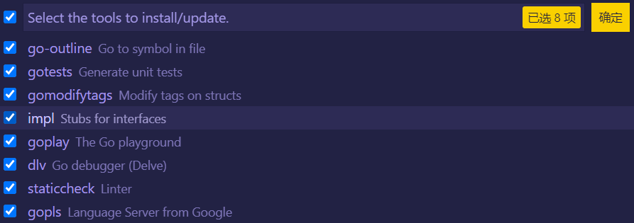

# Go 开发环境配置

目录：

- [Ubuntu 配置](#ubuntu-配置)
- [Windows 配置](#windows-配置)
- [VScode 配置](#vscode-配置)
- [容器环境配置](#容器环境配置)
- [WSL 配置](#wsl-配置)
- [TODO](#todo)

## Ubuntu 配置

Go 安装有两种方式：

1. 使用 apt 安装：`sudo apt install golang-go`，默认安装的是 13.8 版本。
2. 使用 wget 下载官网安装包安装：`wget https://golang.google.cn/dl/go1.18.linux-amd64.tar.gz`
    - 卸载旧版本（可选）：`apt remove golang-go`
    - 下载新版本：`wget https://golang.google.cn/dl/go1.18.linux-amd64.tar.gz`
    - 解压到 `/usr/local`：`tar -zxvf go1.18.linux-amd64.tar.gz -C /usr/local`
    - 设置环境变量，在 `.bashrc` 中添加以下配置，新打开一个 shell 窗口，使之生效。

        ```bash
        export GOPATH=/home/tomato/gopath
        export GOROOT=/usr/local/go
        export PATH=$PATH:$GOROOT/bin:$GOPATH/bin
        ```

    - 为了加载你的配置，bash 在每次启动时都会加载 `.bashrc` 文件的内容。每个用户的 home 目录都有这个 shell 脚本。它用来存储并加载你的终端配置和环境变量。
    - 也可在 `/etc/priofile` 中添加，设置成全局生效（对所有用户都生效）。

    - 查看是否安装成功：`go version`、`go env`

配置 Go 包下载代理服务器，防止有些依赖下载失败。
  `go env -w GOPROXY=https://goproxy.cn,direct`

## Windows 配置

略。

## VScode 配置

1. 安装 [Go 插件](https://marketplace.visualstudio.com/items?itemName=golang.Go)

2. 安装 Go 插件相关（依赖）的工具:

    - 快捷键 `ctrl+shift+p` 调出命令面板，输入 `go install tools`，选择 `Go: Install/Update Tools`，把所有选项进行勾选:

        

    - 此过程可能失败，解决方法：设置 go proxy
        `go env -w GOPROXY=https://goproxy.cn,direct`
3. 如果是远程开发，还需要安装插件 [Remote - SSH](https://marketplace.visualstudio.com/items?itemName=ms-vscode-remote.remote-ssh)

## 容器环境配置

待做

## WSL 配置

安装插件 [Remote - WSL](https://marketplace.visualstudio.com/items?itemName=ms-vscode-remote.remote-wsl)

## TODO

- [ ] 容器环境配置
