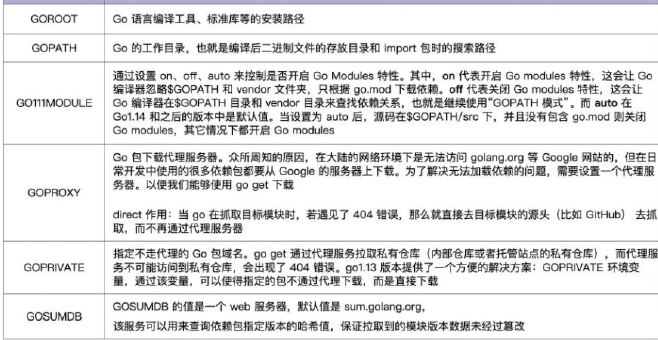

# Go 常用命令

## TODO

- [ ] 在实际项目中使用以下命令，基本流程待熟悉
- [ ] 了解各命令对应的一些常用的参数的含义，个别参数还是很好用的
- [ ] 其他高级用法，慢慢补充
- [ ] 一些命令使用的细节问题，慢慢补充

## 遇到的错误和解决方法

```bash
tomato@DESKTOP-DNRME39:~/go-demo$ tree
.
├── go-test
├── go.mod
├── go.sum
├── main.go
└── test-package
    └── test.go
tomato@DESKTOP-DNRME39:~/go-demo$ go build test
package test is not in GOROOT (/usr/local/go/src/test)
```

关于多个包、嵌套包的导入可参考 ["package XXX is not in GOROOT" when building a Go project](https://stackoverflow.com/questions/61845013/package-xxx-is-not-in-goroot-when-building-a-go-project)

## 源码文件

Go 语言的源码文件分为三类：命令源码、库源码、测试源码。

- 命令源码文件：是 Go 程序的入口，包含 func main() 函数，且第一行用 package main 声明属于 main 包。
- 库源码文件：主要是各种函数、接口等，例如工具类的函数。
- 测试源码文件：以 `_test.go` 为后缀的文件，用于测试程序的功能和性能。

## Go 相关变量



### GO111MODULE

最初，Go的包管理工具依赖于GOPATH或者vender目录，例如：

- govender
- dep
- glide
- godep

`GO111MODULE`：Go 1.11时，官方推出了版本管理工具 `go module`，并且从1.13开始，将其作为Go语言默认的依赖管理工具。

国内使用Go语言，必须配置Proxy，否则很多库依赖是访问不到的：

- Windows 下设置 GOPROXY 的命令为：
`set GOPROXY=https://goproxy.cn`
`go env -w GOPROXY=https://goproxy.cn,direct`

- MacOS 或 Linux 下设置 GOPROXY 的命令为：
`export GOPROXY=https://goproxy.cn`

其次是 `GO111MODULE`，通过它可以选择开启或者关闭模块支持，它主要有三个可选值：`off`、`on`、`auto`，默认值是`auto`:

- `GO111MODULE=off` 禁用模块支持，编译项目时，会从`GOPATH`和`vender`文件夹中查找包
- `GO111MODULE=on` 启用模块支持，编译时会忽略`GOPATH`和`vender`目录，只根据`go.mod`文件中的依赖信息下载、寻找依赖，依赖文件默认会存储在`GOPATH/pkg/mod`目录下（在使用模块的时候，GOPATH 是无意义的，不过它还是会把下载的依赖储存在 `$GOPATH/pkg/mod` 中，也会把 `go install` 的结果放在 `$GOPATH/bin` 中。）。
- `GOPATH111MODULE=auto` 将会根据项目目录下是否有`go.mod`文件、`vender`目录自动选择当前模式 （如果当前目录不在 `$GOPATH` 或者当前目录（或者父目录）下有`go.mod`文件，则使用 `GO111MODULE`， 否则仍旧使用 `GOPATH` mode。）

- MacOS或Linux下开启GO111MODULE的命令为：

    `export GO111MODULE=on`、`export GO111MODULE=auto`、    `go env -w GO111MODULE=on`
- windows
    `go env -w GO111MODULE=on`

## 常用命令

### go build

go build 命令主要用于编译代码。在包的编译过程中，若有必要，会同时编译与之相关联的包。

go build 有很多种编译方法，如无参数编译、文件列表编译、指定包编译等，使用这些方法都可以输出可执行文件。

有以下几种编译方式：

- `go build` ：无参数编译，生成的可执行程序名称和目录名（模块名称）一致，默认会编译当前目录下的所有go文件，前提是该目录下有main包
- `go build 单个文件`: 可执行文件名称和文件名称一样
- `go build 文件列表`：使用“go build+文件列表”方式编译时，可执行文件默认选择文件列表中第一个源码文件名作为可执行文件名输出。
- `go build 包名`：可执行程序名称和包名（模块名称）一致。包名即go.mod中module对应的名称。

若要指定文件名，可使用参数 `-o`，也可指定文件输出的目录。
`go build -o main.exe`

`go build` 会忽略 `*_test.go` 文件。

具体可通过 `go help build` 查看

参考 [go build命令（go语言编译命令）完全攻略](http://c.biancheng.net/view/120.html)

### go install

`go install` 跟 `go build` 类似，只是多做了一件事就是安装编译后的文件到指定目录。

与 `go build` 命令类似，附加参数绝大多数都可以与 `go build` 通用。`go install` 只是将编译的中间文件放在 `GOPATH` 的 `pkg` 目录下，以及固定地将编译结果放在 `GOPATH` 的 `bin` 目录下。

这个命令在内部实际上分成了两步操作：第一步是生成结果文件（可执行文件或者 `.a` 包），第二步会把编译好的结果移到 `$GOPATH/pkg` 或者 `$GOPATH/bin`。

go install 的编译过程有如下规律：

- GOPATH 下的 bin 目录放置的是使用 go install 生成的可执行文件，可执行文件的名称来自于编译时的包名。
- go install 输出目录始终为 GOPATH 下的 bin 目录，无法使用-o附加参数进行自定义。
- GOPATH 下的 pkg 目录放置的是编译期间的中间文件。

产生两类文件：

- 可执行文件： 一般是 go install 带main函数的go文件产生的，有函数入口，所有可以直接运行。
- `.a`应用包： 一般是 go install 不包含main函数的go文件产生的，没有函数入口，只能被调用。

新版变化，可参考：
[Go 1.16 中关于 go get 和 go install 你需要注意的地方](https://segmentfault.com/a/1190000038541867)

### go get

go get 命令可以借助代码管理工具通过远程拉取或更新代码包及其依赖包，并自动完成编译和安装。整个过程就像安装一个 App 一样简单。

go mod 想下载指定的版本 通常我们有三种做法

- `go get 包路径@v版本号`
- `go get 包路径@分支`, `分支是指在github上提交的分支`
- `go get 包路径@git提交的哈希`

常用参数：

|参数|含义|
|-|-|
|-d|只下载，不安装|
|-u|会升级到最新的次要版本或者修订版本(x.y.z, z是修订版本号， y是次要版本号)|

总结：

- go get 通常用于在 Go Module 中添加依赖使用
- go get 的代码被下载到 $GOPATH/pkg/mod 目录下

### 对比 go build、go install、go get

区别：

- go build : 编译出可执行文件
- go install : go build + 把编译后的可执行文件放到GOPATH/bin目录下
- go get : git clone + go install（从指定源上面下载或者更新指定的代码和依赖，并对他们进行编译和安装）

在很多时候，一个常用的操作模式是：

- 通过 `go get -d` 下载模块代码
- 修改下载下来的代码
- 通过 `go install` 安装

参考 [Go语言的三个命令 go build, go install, go get](https://segmentfault.com/q/1010000004044176)

### go mod

> GO Modules 也称作 go mod，是golang 官方最新的几个golang 版本中推出的包管理方式或者称作模块支持
>> golang 中 modules (模块)是什么意思呢?
>>>一个模块是一系列 Go 代码包的集合，它们保存在同一个文件树中。文件树的根目录中包含了一个 go.mod 文件。go.mod 文件定义了一个模块的 module path，这就是模块根目录的导入路径。go.mod 文件还定义了模块的 dependency requirements（依赖项要求），即为了编译本模块，需要用到哪些其它的模块。每一项依赖项要求都包含了依赖项的 module path，还要指定它的语义版本。

常用命令：

- `go help mod`：查看基本用法：

- `go mod init`: 初始化当前目录中的新模块，创建go.mod文件，后跟模块名称，可以是多级目录，如`github.com/captain/modDemo`
- `go mod tidy`：增加缺失的Module，删除无效的Module
- `go mod download` 可以下载所需要的依赖，但是依赖并不是下载到`$GOPATH`中，而是`$GOPATH/pkg/mod`中，多个项目可以共享缓存的module。

go.mod 提供了module, require、replace和exclude 四个命令：

- module 用来定义包名（路径）和我们初始化的包名是一致的
- require 定义依赖的包及其对应的版本
  - indirect 标识间接引用

- replace 语句可以替换依赖项模块
- exclude 语句可以忽略依赖项模块

参考：[跳出Go module的泥潭](https://colobu.com/2018/08/27/learn-go-module/)

### go list

`go list -m all`: 列出当前模块和它的依赖库
`go list -m -versions 库名地址`: 列出一个模块能用的版本

### go fmt

go fmt命令是 gofmt 的简单封装，用来格式化代码文件

gofmt 是一个 cli 程序，会优先读取标准输入，如果传入了文件路径的话，会格式化这个文件，如果传入一个目录，会格式化目录中所有 `.go` 文件，如果不传参数，会格式化当前目录下的所有 `.go` 文件。

使用go fmt命令，更多时候是用gofmt，而且需要参数`-w`，否则格式化结果不会写入文件。`gofmt -w src`，可以格式化整个项目。

### go run

运行源码文件/编译并运行Go程序

go run其实是执行一个exe文件(window)，go build 入口是一个main包，有main包才能生产exe文件，一个mian包里只能有一个唯一的main方法

只有主包中的文件是可执行的，即具有声明package main的文件

go run 执行方式参考 ["package XXX is not in GOROOT" when building a Go project](https://stackoverflow.com/questions/61845013/package-xxx-is-not-in-goroot-when-building-a-go-project)

结合上述参考链接总结得：

- 在项目目录下只有main包，同时main包下有其他文件，运行程序需执行：`go run .`
- 在项目目录下有多个自定义包（嵌套包），同时main包下只有main.go，且main.go引用了自定义包的变量，运行此程序执行：`go run main.go` 即可

### go clean

执行go clean命令会删除掉执行其它命令时产生的一些文件和目录，包括：

- 在使用go build命令时在当前代码包下生成的与包名同名或者与Go源码文件同名的可执行文件。在Windows下，则是与包名同名或者Go源码文件同名且带有“.exe”后缀的文件。

- 在执行go test命令并加入-c标记时在当前代码包下生成的以包名加“.test”后缀为名的文件。在Windows下，则是以包名加“.test.exe”后缀为名的文件。我们会在后面专门介绍go test命令。

- 如果执行go clean命令时带有标记-i，则会同时删除安装当前代码包时所产生的结果文件。如果当前代码包中只包含库源码文件，则结果文件指的就是在工作区的pkg目录的相应目录下的归档文件。如果当前代码包中只包含一个命令源码文件，则结果文件指的就是在工作区的bin目录下的可执行文件。

- 还有一些目录和文件是在编译Go或C源码文件时留在相应目录中的。包括：“_obj”和“_test”目录，名称为“_testmain.go”、“test.out”、“build.out”或“a.out”的文件，名称以“.5”、“.6”、“.8”、“.a”、“.o”或“.so”为后缀的文件。这些目录和文件是在执行go build命令时生成在临时目录中的。

- 如果执行go clean命令时带有标记-r，则还包括当前代码包的所有依赖包的上述目录和文件。

### go doc

go doc 命令其实就是一个很强大的文档工具。

如何查看相应package的文档呢？ 例如builtin包，那么执行`go doc builtin`；如果是http包，那么执行`go doc net/http`；查看某一个包里面的函数，那么执行`go doc fmt Printf`；也可以查看相应的代码，执行`go doc -src fmt Printf`；

godoc命令和 go doc 命令类似，命令godoc是一个很强大的工具，同样用于展示指定代码包的文档。

通过命令在命令行执行 `godoc -http=:端口号` 比如`godoc -http=:8080`。然后在浏览器中打开127.0.0.1:8080，你将会看到一个golang.org的本地copy版本，通过它你可以查询pkg文档等其它内容。如果你设置了GOPATH，在pkg分类下，不但会列出标准包的文档，还会列出你本地GOPATH中所有项目的相关文档，这对于经常被限制访问的用户来说是一个不错的选择。

### go test

go test 命令，会自动读取源码目录下面名为 *_test.go 的文件，会以代码包为单位打印出测试概要信息

### go pprof

可以帮助开发者快速分析及定位各种性能问题，如 CPU 消耗、内存分配及阻塞分析

### go env

命令go env用于打印Go语言的环境信息。

### go version

显示go版本信息

### go fix

用来修复以前老版本的代码到新版本，例如go1之前老版本的代码转化到go1

### go generate

go generate命令是在Go语言 1.4 版本里面新添加的一个命令，当运行该命令时，它将扫描与当前包相关的源代码文件，找出所有包含//go:generate的特殊注释，提取并执行该特殊注释后面的命令。

### go vet

### go tool cgo

## 参考资料

- [GO语言学习之GO MODULE](https://jeffdingzone.com/2020/10/go%E8%AF%AD%E8%A8%80%E5%AD%A6%E4%B9%A0%E4%B9%8Bgo-module/)
- [深入Go Module之go.mod文件解析](https://colobu.com/2021/06/28/dive-into-go-module-1/)
- [Go mod 使用](https://segmentfault.com/a/1190000018536993)
- [Go命令详解](https://zhuanlan.zhihu.com/p/161494871)
- [go build命令（go语言编译命令）完全攻略](http://c.biancheng.net/view/120.html)
- [go get命令——一键获取代码、编译并安装](http://c.biancheng.net/view/123.html)
- [go - 使用 go mod 管理项目依赖](https://segmentfault.com/a/1190000019724582)
- [Go 1.16 中关于 go get 和 go install 你需要注意的地方](https://segmentfault.com/a/1190000038541867)
- [Go标准命令详解](https://www.kancloud.cn/cattong/go_command_tutorial/261346)