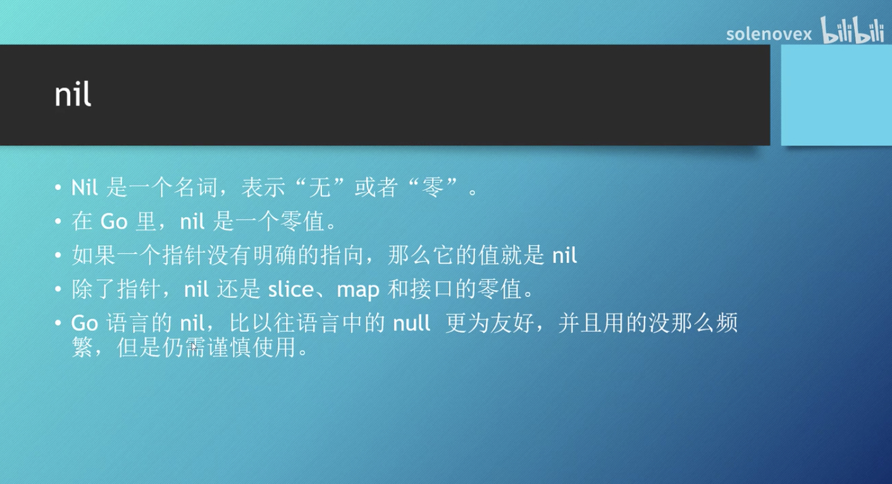

# 记录学 go 的过程

学习资料链接:

- [Go 语言编程快速入门（Golang）](https://www.bilibili.com/video/BV1fD4y1m7TD?p=1)
- [Go Web 编程快速入门【Golang/Go语言】](https://www.bilibili.com/video/BV1Xv411k7Xn?p=1)
- [【千锋教育】Go 语言全套视频教程 基础+进阶+高级（学完可就业/入门到精通）](https://www.bilibili.com/video/BV1jJ411c7s3)
  - [教程文档和源代码](https://www.qfgolang.com/)
  - [基础篇源代码](https://github.com/rubyhan1314/go_foundation)
  - [Golang-100-Days](https://github.com/rubyhan1314/Golang-100-Days)
  - [Go 语言中包的使用](https://www.qfgolang.com/?special=baoguanli)
- [Go 语言（C 语言中文网）](http://c.biancheng.net/golang/intro/)

官方文档

- [Golang 标准库文档](https://studygolang.com/pkgdoc)
- [Go Standard library](https://pkg.go.dev/std) 
- [Go Packages](http://docscn.studygolang.com/pkg/)

## IDE 配置：vsode 插件配置、激活码

vscode 配置

首先在扩展中搜索 go 插件进行安装。

之后在终端输入：

- 更换安装源

```bash
bogon: $ go env -w GO111MODULE=on
bogon: $ go env -w GOPROXY=https://goproxy.cn,direct
```

- 安装必要的开发工具包
  - 打开 vscode 的命令框，快捷键：`command(ctrl)+shift+p`
  - 运行：`Go：Install/Update Tools` 命令，勾选全部出现的包进行安装即可。
  - 是否安装成功，跟网络关系很大，存在连不上 `github` 的可能，多次尝试。

使用 专门的 IDE：GoLand
通过激活码激活

- [golang 激活码【2021免费激活】](https://www.yht7.com/news/152498)

## 命名规范

参考: [Go 标识符的命名规范](https://zhuanlan.zhihu.com/p/216001587)

## 独特的语法

当标识符（包括常量、变量、类型、函数名、结构字段等等）以一个大写字母开头，如：Group1，那么使用这种形式的标识符的对象就可以被外部包的代码所使用（客户端程序需要先导入这个包），这被称为导出（像面向对象语言中的 public）；标识符如果以小写字母开头，则对包外是不可见的，但是他们在整个包的内部是可见并且可用的（像面向对象语言中的 protected ）。

## 常量

const 用来声明常量，常量的值不可改变。

例外：
`iota` 特殊常量，可以认为是一个可以被编译器修改的常量。

iota 在 const 关键字出现时将被重置为 0(const 内部的第一行之前)，const 中每新增一行常量声明将使 iota 计数一次(iota 可理解为 const 语句块中的行索引)。

iota 可以被用作枚举值

具体示例:[Go 语言常量](https://www.runoob.com/go/go-constants.html)

## 变量

`var` 用来声明变量

- 想要使用变量首先需要进行声明

第一种，指定变量类型，如果没有初始化，则变量默认为零值。

  `var v_name v_type`

  ```go
  var i int
  var f float64
  var b bool
  var s string
  var a string = "Runoob"
  ```

- 数值类型（包括 complex64/128）为 0
- 布尔类型为 false
- 字符串为 ""（空字符串）
- 以下几种类型为 nil：

  ```go
  var a *int
  var a []int
  var a map[string] int
  var a chan int // chan int
  var a func(string) int // func(string) int
  var a interface{}
  ```

第二种，根据值自行判定变量类型。

`var v_name = value`

  ```go
  var d = true
  var e = "good"
  ```

第三种，省略 `var`，**短声明**，注意 `:=` 左侧如果没有声明新的变量，就产生编译错误，格式：
`v_name := value`

```go
var intVal int 
intVal :=1 // 这时候会产生编译错误，因为 intVal 已经声明，不需要重新声明

// 直接使用下面的语句即可：
intVal := 1 // 此时不会产生编译错误，因为有声明新的变量，因为 := 是一个声明语句

// intVal := 1 相等于：
var intVal int 
intVal =1 
```

多变量声明

```go
//类型相同多个变量, 非全局变量
var vname1, vname2, vname3 type
vname1, vname2, vname3 = v1, v2, v3

var vname1, vname2, vname3 = v1, v2, v3 // 和 python 很像,不需要显示声明类型，自动推断

vname1, vname2, vname3 := v1, v2, v3 // 出现在 := 左侧的变量不应该是已经被声明过的，否则会导致编译错误


// 这种因式分解关键字的写法一般用于声明全局变量
var (
    vname1 v_type1
    vname2 v_type2
)

```

**注意事项**

如果在相同的代码块中，我们不可以再次对于相同名称的变量使用初始化声明，例如：`a := 20` 就是不被允许的，编译器会提示错误 `no new variables on left side of :=`，但是 a = 20 是可以的，因为这是给相同的变量赋予一个新的值。

如果你在定义变量 a 之前使用它，则会得到编译错误 `undefined: a`。

如果**你声明了一个局部变量**却没有在相同的代码块中使用它，同样会得到编译错误，例如下面这个例子当中的变量 a：
但对于常量来说，声明常量之后可以不使用。

实例

```go
package main

import "fmt"

func main() {
   var a string = "abc"
   fmt.Println("hello, world")
}
```

尝试编译这段代码将得到错误 `a declared and not used`。
此外，单纯地给 a 赋值也是不够的，这个值必须被使用，所以使用

`fmt.Println("hello, world", a)`

但是**全局变量是允许声明但不使用**的。 同一类型的多个变量可以声明在同一行，如：`var a, b, c int`

多变量可以在同一行进行赋值，如：

```go
var a, b int
var c string
a, b, c = 5, 7, "abc"
```

上面这行假设了变量 a，b 和 c 都已经被声明，否则的话应该这样使用：
`a, b, c := 5, 7, "abc"`
右边的这些值以相同的顺序赋值给左边的变量，所以 a 的值是 5， b 的值是 7，c 的值是 "abc"。

这被称为 `并行` 或 `同时` 赋值。

如果你想要交换两个变量的值，则可以简单地使用 `a, b = b, a`，两个变量的类型必须是相同。
空白标识符 `_` 也被用于抛弃值，如值 5 在：`_, b = 5, 7` 中被抛弃。

`_` 实际上是一个**只写变量**，你不能得到它的值。这样做是因为 Go 语言中你必须使用所有被声明的变量，但有时你并不需要使用从一个函数得到的所有返回值。

并行赋值也被用于当一个函数返回多个返回值时，比如这里的 val 和错误 err 是通过调用 Func1 函数同时得到：`val, err = Func1(var1)`。

结构体初始化

- [Go 结构体与初始化](https://www.cnblogs.com/liyutian/p/10050320.html)
- [Go语言初始化结构体的成员变量](http://c.biancheng.net/view/67.html)

## 数据类型

派生类型：

- (a) 指针类型（Pointer）
- (b) 数组类型
- (c) 结构化类型(struct)
- (d) Channel 类型
- (e) 函数类型
- (f) 切片类型
- (g) 接口类型（interface）
- (h) Map 类型

以及其他不熟悉的数字类型等

- [x] float32
- [x] uint 无符号整数（正整数和0）
- pointer nil
- uintptr
- rune（int32 的类型别名）
- byte（int8 的类型别名）

参考：[Go 语言数据类型](https://www.runoob.com/go/go-data-types.html)

## 运算符

其他运算符

|运算符|描述|实例|
|-|-|-|
|&|返回变量存储地址|&a; 将给出变量的实际地址。|
|*|指针变量。|*a; 是一个指针变量|

有没有 取反 的运算法？

## 浮点类型

如果没有为指数形式的数值指定类型的话，那么 go 会将它视作 float64 类型

浮点类型不适合金融类型计算
为了最小化舍入错误，建议先做乘法再做除法

```go
celsiue := 21.0
fmt.Println(celsiue / 5.0 * 9.0) // 37.800000000000004
fmt.Println(9.0 / 5.0 *celsiue)  // 37.800000000000004
fmt.Println(celsiue*9.0 / 5.0)  // 37.8
```

## 整数环绕（溢出）

所有整数类型都有一个取值范围，超出这个范围，就会发生环绕
示例：

```go
var red uint8 = 255
red++ // 0

var number int8=127
num++ // -128
```

## nil

nil 是一个零值
如果一个指针没有明确的指向，那么它的值就是nil，程序就无法对其解引用，尝试解引用一个nil指针将导致程序崩溃
除了指针，nil还是slice、map和接口的零值

- slice
- map
- 接口



## 可变参数

```go
func fun(a ...interface{}){
  return
}
```

## 通过方法添加行为

每个方法可以有多个参数，但只能有一个接收者

```go
type person struct{}
func (p person) doMan(age int,name string){

}
```

## 指针

- 一般用来当作函数的参数，去修改实参的值
- 有时候传递拷贝的副本值太大，用指针

- 推荐在方法上使用指针（前提是这个类型不是 map、slice ，channel 等引用类型）
- 当结构体较大的时候使用指针会更高效，可以避免内存拷贝，“结构较大” 到底多大才算大可能需要自己或团队衡量，如超过 5 个字段或者根据结构体内存占用来计算
- 如果要修改结构体（数组等）内部的数据或状态必须使用指针
- 如果方法的receiver是map、slice 、channel等引用类型不要使用指针
- 小数据类型如 bool、int 等没必要使用指针传递
- 如果该函数会修改receiver或变量等，使用指针

[[Go] 进阶知识 - 指针 | 结构体 | 方法](https://zhuanlan.zhihu.com/p/352922377)

## new 和 make

`var a *int` 只是声明了一个指针变量a但是没有初始化，指针作为引用类型需要初始化后才会拥有内存空间，才可以给它赋值
正确操作

```go
var a *int
a=new(int)

// 其他类型：map、slice、channel 使用make来进行初始化变量
```

简单总结：

- 使用make()，来初始化slice，map 和channel 。 
- 大多数场合，类型明确的场合下，使用短变量声明方式:=。
- 当使用文字方式初始化一个变量，并且需要指明类型时，使用var变量声明方式。
- 避免使用new()，除非你需要一个指针变量。

new与make的区别：

- 二者都是用来做内存分配的。
- make只用于slice、map以及channel的初始化，返回的还是这三个引用类型本身；
- 而new用于类型的内存分配，并且内存对应的值为类型零值，返回的是指向类型的指针。

参考：

- [[golang] 变量声明和初始化 var, :=, new() 和 make()](https://www.cnblogs.com/steven-yang/p/14621297.html)
- [Go语言 - 指针 | new | make](https://blog.csdn.net/Waller_/article/details/103320430)
## 格式化打印

参考：[Go语言格式化输出](http://www.weixueyuan.net/a/475.html)

常用的有：`%v`、`%b`、`%f`、`%d`、`%x`、`c%`、`%T`、`%p`、`%s`

- `%d`: 整数
- `%b`：二进制位
- `%f`：浮点数
- `%v`：原样打印
- `%+v`: 类似 %v，但输出结构体时会添加字段名
- `%x`：十六进制
- `c%`：unicode 码
- `%T`：类型
- `%p`：内存地址
- `%s`：直接输出字符串或者字节数组

指定宽度和填充

- `%08b`
- `%4.2f`
- `%4v`(向左填充)、`%-15v`（向右填充）
- `%02x`

## 内置函数

字符串中的len(): 得到的是字符串**字节数**，而非字符个数（长度）。

- 其他内置方法待总结整理，自带的一些库的用法
  - new
  - 类型转换

## go 工具包

以下命令的使用待弄清楚

- go mod init
- go run
- go build

以及包管理、依赖管理等

## 继承还是组合

- 优先使用对象组合而不是类的继承
- 对传统的继承不是必须的，所有使用继承解决的问题都可以通过其他方法解决

## 错误处理

- 优雅的返回错误
- 按需返回错误
- 类型断言

错误值、panic、os.Exit

- 通常更推荐使用错误值，其次是 panic
- panic 比 os.Exit 更好，panic 后会执行所有 defer 的动作，而 os.Exit 不会
- 有时候 go 程序会 panic 而不是返回错误值

## channel

继续练习学习
是那么时候需要关闭什么时候无需关闭？跟发送数据量有关，已发送完，已读完，就可以退出goroutine，通道自然就关闭了

## time

`rand.Seed(time.Now().UnixNano())` 补下基础

## 互斥锁

以下行为会发生什么

- 锁定已被锁定的互斥锁
- 对一个未被锁定的互斥锁解锁
- 同时在不同的goroutine里面调用相同类型的方法是安装的么

## 待继续学习

- switch 语句还可以被用于 type-switch 来判断某个 interface 变量中实际存储的变量类型。可参考：[Type Switch](https://www.runoob.com/go/go-switch-statement.html)

- switch 多条件匹配，以及搭配 `fallthrough` 使用等
  - 单独的一个 `fallthrough` 只能执行匹配成功后的case后的第一个case，多个的话，要加多个 `fallthrough`

- 控制台输入
- 数组、切片、结构体、接口、
- 循环练一下 range
- num:=rand.Intn(10) 为什么有时候是固定的数字？
  - [GO获取随机数](https://www.cnblogs.com/aresxin/p/go-random.html)
  - 种子数理解
- 待完成的练习
  - 前往火星的航行票

- 格式化输出 `%-15v`、`%4v`

- 格式化输出：
  - [go 格式化输出](https://www.cnblogs.com/liubiaos/p/9367504.html)
  - [Go基础：格式化输出--Printf、Sprintf、Fprintf](https://blog.csdn.net/fly910905/article/details/106281046)

- 大数 big.Int

- select 语句: [select 语句](https://www.runoob.com/go/go-select-statement.html)

- 通道(channel)待继续练习
- 切片
- 浮点数计算输出有一定的偏差，你也可以转整型来设置精度。
- go 怎么查看函数 快捷键

- break、continue、goto 标签用法
- 构造函数
- 常用的一些包/库
  - io
  - strconv
  - bufio
  - http/net
  - os
  - time
- 算法题做2道
- `type DirEntry = fs.DirEntry` 这种写法学习
- `|` `||` 区别

- 接口的方法实现，只要保证函数参数类型和返回方法和类型保持一直即可，形参可能不同

```go
// io
type Reader interface {
  Read(p []byte) (n int, err error)
}

// os
func (f *File) Read(b []byte) (n int, err error)

```

- `time go run demo05_copy.go` 可以显示程序的执行时间

```bash
$ time go run demo05_copy.go
拷贝完毕。。。
9257 <nil>

real    0m1.103s
user    0m0.231s
sys     0m0.460s
```

- 字符切片和字符串相互转换
  - [golang 字符切片、字符串互转](https://blog.csdn.net/whatday/article/details/109775284)
  - [golang runes 字符串 互转](https://blog.csdn.net/whatday/article/details/109775355)

``` go


// []byte -> string
sl := []byte{97, 98, 99, 100}
s := string(sl)
fmt.Println(s) //abcd

// string -> []byte
sl1 := []byte(s)
fmt.Println(sl1)

```

- 值传递，引用传递总结一下

- go 中没有引用传递，只有值传递，每个变量都是唯一的，值传递即拷贝副本 带总结
  - [go 中没有引用传递](https://zhuanlan.zhihu.com/p/388808744?utm_source=wechat_session&utm_medium=social&utm_oi=630516272207761408)

## 参考

部分笔记采取“直接搬来”，部分加上自己的理解！

- [Go 语言基础语法](https://www.runoob.com/go/go-basic-syntax.html)

- 程序中可能会使用到这些标点符号：; 和 …。
  - `;` `…` 使用场景
  - Go 语言中变量的声明必须使用空格隔开
  `var age int;`、`fruit = apples + oranges;`
